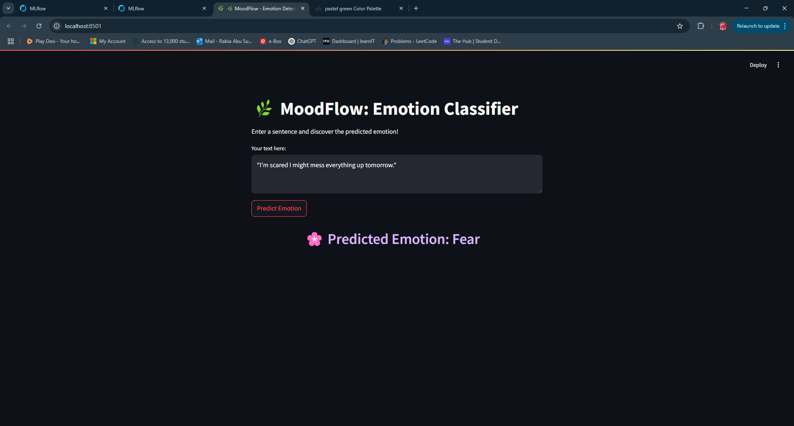

# 🧠 MoodFlow: Emotion Classification with MLOps

**MoodFlow** is a simple yet powerful MLOps project focused on classifying emotions in text (e.g., tweets), built around a fine-tuned **DistilBERT** model.

The model was trained on a large-scale, cleaned **emotion-rich dataset**, with full experiment tracking using **MLflow** and data versioning using **DVC**.

Users can interactively experience emotion detection in real time, making MoodFlow both an engaging demo and a professional NLP showcase.  
It is designed to explore the full machine learning workflow using:

- ✅ [DVC](https://dvc.org/) for data and model version control  
- ✅ [MLflow](https://mlflow.org/) for experiment tracking  
- ✅ [Streamlit](https://streamlit.io/) for a simple and interactive user interface 

<p align="center">
  
</p>

---

## 📁 Project Structure

```bash
moodflow/
├── data/
│   ├── simple/         # Dataset 1: split into train/test/validation
│   └── rich/           # Dataset 2: richer version, with additional label
├── notebooks/
│   └── models/         # Fine-tuned model artifacts (DVC-tracked)
├── app_predict.py      # Streamlit app for interactive emotion prediction
├── .dvc/               # DVC metadata
├── .gitignore
├── .dvcignore
└── README.md
```

---

## 🧪 Dataset Notes

During exploratory analysis, the label distributions in both the *simple* and *rich* datasets were compared.

| Label | Simple Dataset (%) | Rich Dataset (%) |
|:------|:--------------------|:-----------------|
| 0     | 28.98%              | 29.07%           |
| 1     | 33.80%              | 33.84%           |
| 2     | 8.20%               | 8.29%            |
| 3     | 13.54%              | 13.75%           |
| 4     | 11.86%              | 11.45%           |
| 5     | 3.60%               | 3.59%            |

📌 These nearly identical label ratios suggest that the **simple dataset** is a curated subset of the **rich dataset**.  
To reduce redundancy and leverage more training data, only the **rich dataset** is used in the final modeling pipeline.

---

## 🌟 Final Highlights

- Fine-tuned **DistilBERT** model with six emotion classes: Joy, Sadness, Love, Anger, Fear, and Surprise
- Full training and evaluation pipeline tracked using **MLflow**
- Data versioning and model versioning handled cleanly with **DVC**
- Minimalistic, clean **Streamlit app** for real-time predictions
- Fully professional MLOps structure ready for deployment or further experiments

---
